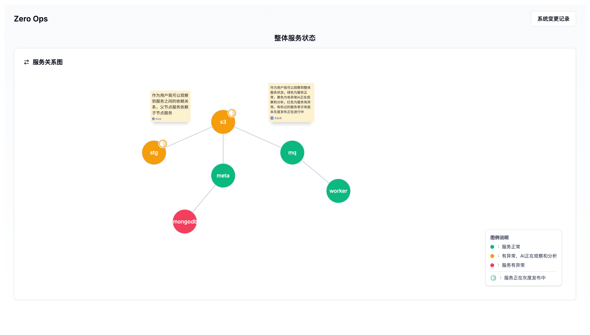
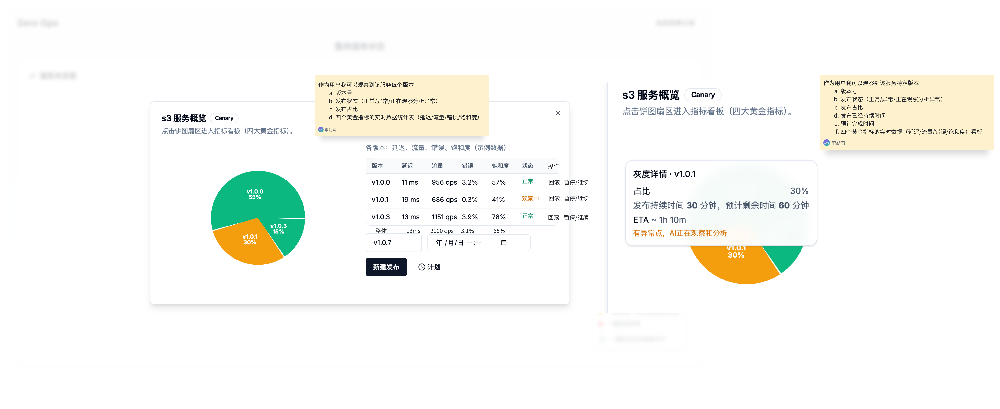
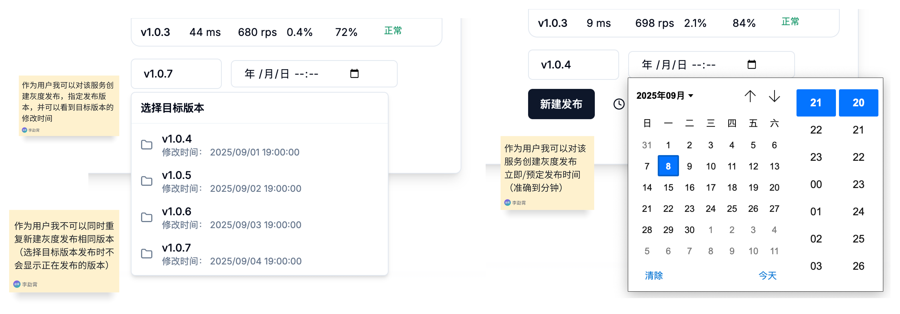
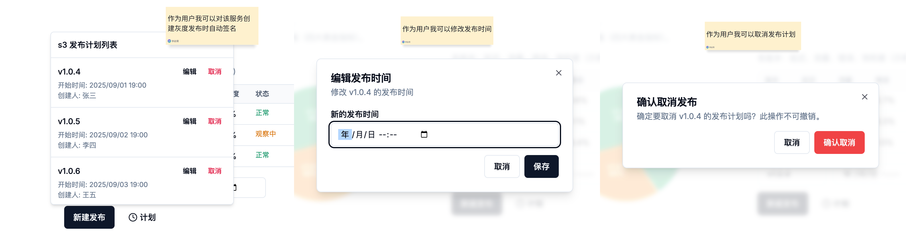
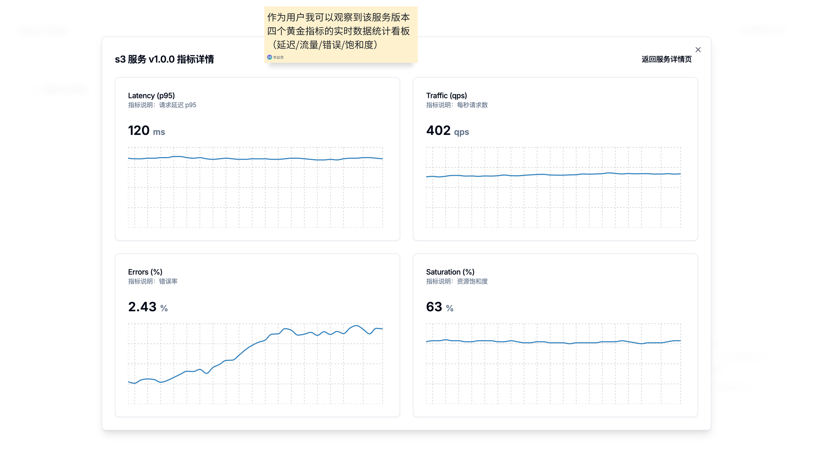
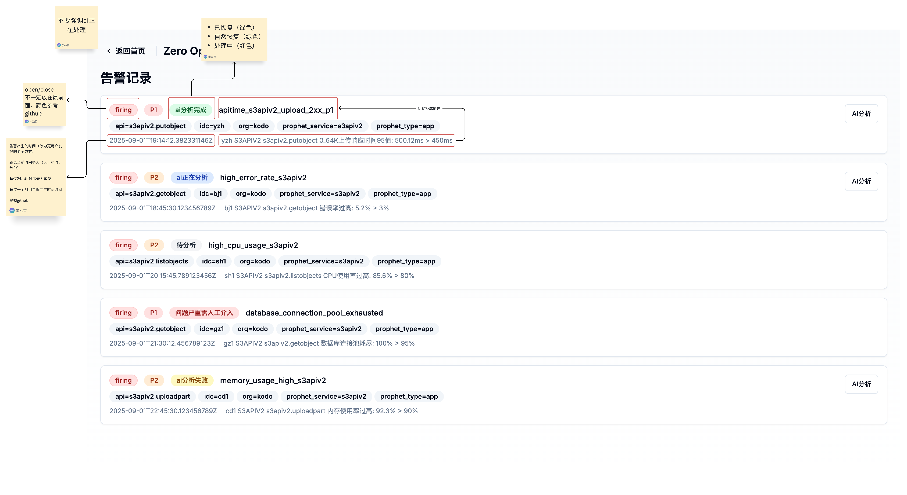
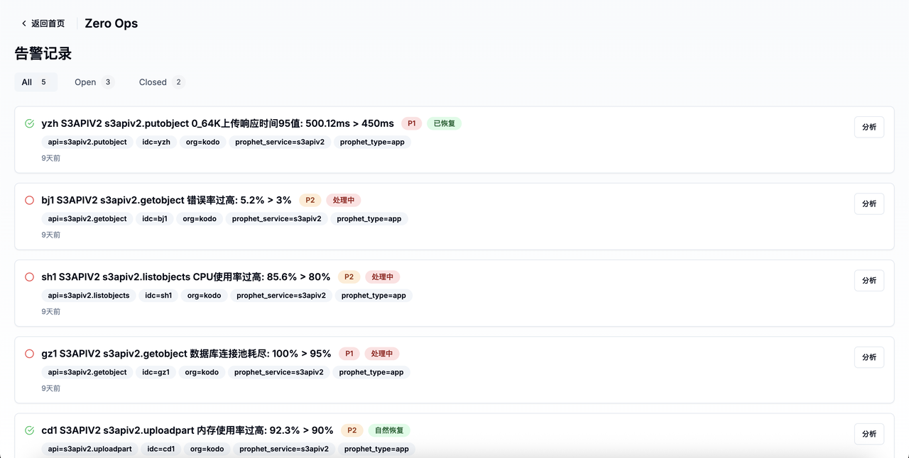
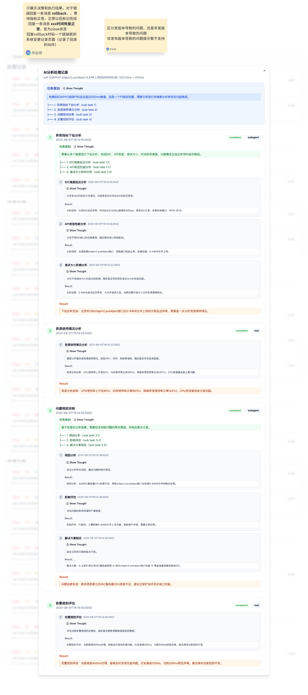
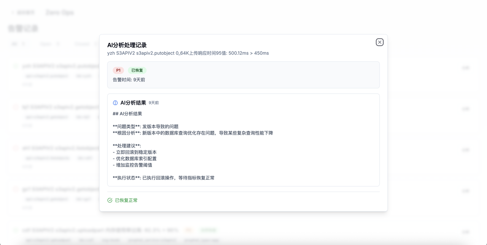
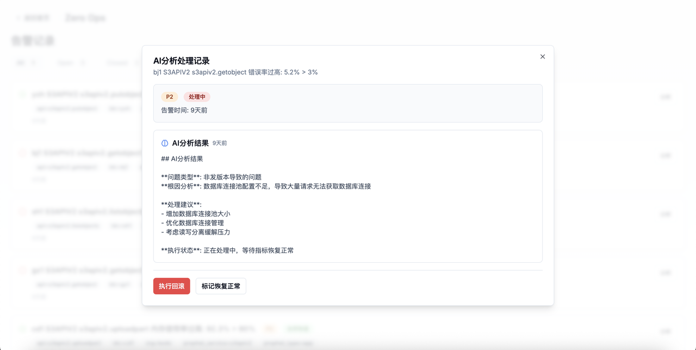

# 产品原型图

## 1. 首页

### 整体服务状态View

**功能描述：**
- 作为用户我可以观察到服务之间的依赖关系，父节点服务依赖子节点服务
- 作为用户我可以观察到整体服务状态，绿色为服务正常，黄色为有异常AI正在观察和分析，红色为服务有异常。有标记的服务表示有版本灰度发布正在进行中

## 2. 服务详情页View及子页面View

### 服务详情页View

**功能描述：**
- 作为用户我可以观察到该服务每个版本
  1. 版本号
  2. 发布状态（正常/异常/正在观察分析异常）
  3. 发布占比
  4. 四个黄金指标的实时数据统计表（延迟/流量/错误/饱和度）
- 作为用户我可以观察到该服务特定版本
  1. 版本号
  2. 发布状态（正常/异常/正在观察分析异常）
  3. 发布占比
  4. 发布已经持续时间
  5. 预计完成时间
  6. 四个黄金指标的实时数据（延迟/流量/错误/饱和度）看板
- 作为用户我可以对服务正在发布的版本进行暂停、继续操作
- 作为用户我可以对服务任何版本进行回滚操作

### 版本发布View

**功能描述：**
- 作为用户我可以对该服务创建灰度发布，指定发布版本，并可以看到目标版本的修改时间
- 作为用户我可以对该服务创建灰度发布，立即/预定发布时间（准确到分钟）
- 作为用户我不可以同时重复新建灰度发布相同版本（选择目标版本发布时不会显示正在发布的版本）

### 发布任务计划View

**功能描述：**
- 作为用户我可以对该服务创建灰度发布时自动签名
- 作为用户我可以修改发布时间
- 作为用户我可以取消发布计划

### 服务指标View

**功能描述：**
- 作为用户我可以观察到该服务版本四个黄金指标的实时数据统计看板（延迟/流量/错误/饱和度）

## 3. 系统状态变更记录页View及子页面View

### 服务变更记录View

**功能描述：**
- 作为用户我可以观察到哪些服务进行了版本发布，完成了多少，健康状态
- 作为用户我可以观察到服务版本发布每一批次的开始时间、结束时间、健康状态

### 告警规则变更记录View

**功能描述：**
- 作为用户我可以观察哪些告警阈值进行了变更，变更了多少，与变更理由

### 事件日志View
（图像待补充）

**功能描述：**
- 作为用户我可以观察到服务版本发布每一批次的详细每一个事件的发生时间、健康状态、事件类型、事件详细数据
- -> AI决策过程

## 4. 告警记录页View及AI分析页面View

> **⚠️ 重要原则：AI分析不要重复解决相同问题**

#### 告警是否关联发布服务
- 告警触发，判断是否与正在灰度的服务有关
- Mock系统里需要将告警带上service与version标签
- 下游服务发布导致上游异常，收到上游告警，看告警服务的依赖项有没有正在发布
### 告警记录View

### AI分析处理记录View

> **🔄 智能规划机制：如果一轮任务规划没有完成任务，会根据上文信息进行新一轮plan，生成新的plan列表**

