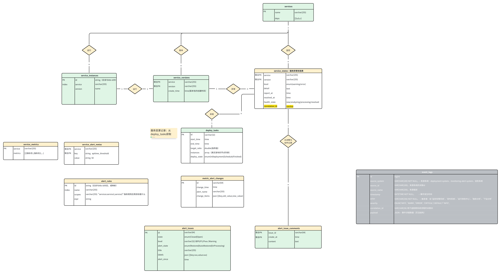

# 数据表设计

## 表结构

## 查询
### 1. 查询某个服务的所有发布任务及对应发布状态
- **涉及表：** `service`、`service_deploy_task`
- **说明：** 通过 `service.id` 与 `service_deploy_task.service_id` 关联，可获取指定服务的所有发布任务记录，包括任务创建者、发布开始 / 结束时间、发布状态等信息。

### 2. 查询某个发布任务下的所有发布批次及批次详情
- **涉及表：** `service_deploy_task`、`deploy_batch`
- **说明：** 利用 `service_deploy_task.id` 和 `deploy_batch.deploy_id` 关联，能得到该发布任务下各批次的开始 / 结束时间、目标发布比例、实际发布节点列表等批次相关信息。

### 3. 查询某个服务版本的异常状态信息
- **涉及表：** `service_version`、`service_state`
- **说明：** 通过 `service_version.id` 与 `service_state.version_id` 关联，可查询到该服务版本对应的异常级别、详细信息、报告时间、解决时间以及健康状态等异常相关数据。

### 4. 查询某个发布批次实际发布的节点及节点对应的服务版本
- **涉及表：** `deploy_batch`、`service_node`
- **说明：** 依据 `deploy_batch.node_ids` 与 `service_node.node_id` 关联，能获取到该发布批次实际发布的节点，以及这些节点对应的服务版本等信息。

### 5. 查询某个服务的所有版本及其创建时间
- **涉及表：** `service`（服务基础信息）、`service_version`（服务版本）
- **说明：** 通过 `service.id` 和 `service_version.service_id` 关联，可列出指定服务的所有版本以及各版本的创建时间

### 6. 查询某个发布任务的所有操作日志
- **涉及表：** `service_deploy_task`、`event_logs`
- **说明：** 通过 `service_deploy_task.correlation_id` 与 `event_logs.correlation_id` 关联，可获取指定发布任务的所有操作日志记录，包括事件类型、事件详情、操作人、发生时间等信息。

### 7. 查询某个服务异常的所有告警日志
- **涉及表：** `alert_issues`、`alert_issue_comments`
- **说明：** 通过 `alert_issues.id` 与 `alert_issue_comments.issue_id` 关联，可获取指定服务异常的所有告警日志记录，包括告警状态、告警分级、告警评论等信息。