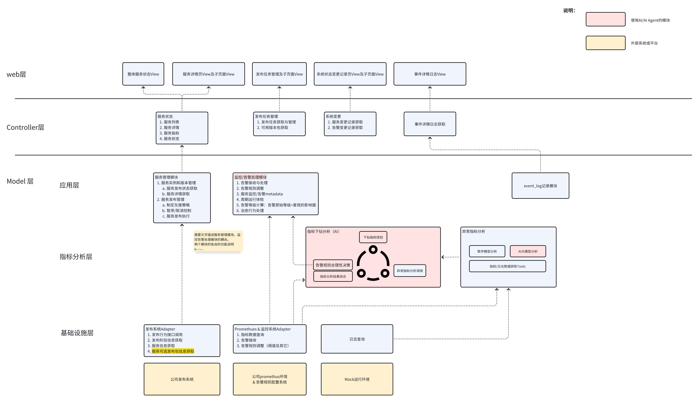

# 概要模块设计

## 架构图

## 模块调用关系

### Web层

| 调用模块 | 被调用模块 | 说明 |
|---------|-----------|------|
| Web层-整体服务状态 | Controller层-服务状态 | 收集系统各服务运行状态，在前端界面宏观展示各服务运行情况 |
| Web层-整体服务状态 | Controller层-服务状态 | 收集系统各服务详细信息，在前端界面展示具体某一服务的详细信息 |
| Web层-发布任务管理及其子页面 | Controller层-发布任务管理 | 获取系统中全部的发布任务和可用服务版本，供用户在前端查看发布任务的执行过程，或选择某一版本的服务创建新的发布任务 |
| Web层-系统变更记录及其子页面 | Controller层-系统变更 | 获取变更记录，变更行为包括服务版本变更和告警阈值变更 |
| Web层-事件详情日志 | Controller层-事件详情日志获取 | 获取日志详情，用户可在界面中查看每一次事件的处理记录 |
| | | |

### Controller层

| 调用模块 | 被调用模块 | 说明 |
|---------|-----------|------|
| Controller层-服务状态 | 应用层-服务信息获取 | 获取系统中各服务的详细信息，包括服务列表、服务状态、服务详情、服务指标、服务状态 |
| Controller层-发布任务管理 | 应用层-发布任务管理与执行 | 在新建发布任务场景下，负责制定灰度策略、选择监控指标、生成发布计划；在发布管理场景下，获取各阶段发布信息，并提供暂停/取消控制功能 |
| Controller层-事件详情日志获取 | 应用层-event_log记录 | 获取变更记录，变更行为包括服务版本变更和告警阈值变更 |
| | | |

### 应用层

| 调用模块 | 被调用模块 | 说明 |
|---------|-----------|------|
| 应用层-服务信息获取 | 基础设施层-发布系统Adapter | 获取系统中的服务信息数据 |
| 应用层-发布任务管理与执行 | 基础设施层-发布系统Adapter | 调用发布行为接口，获取系统中的发布信息数据 |
| 应用层-告警接收与处理 | 基础设施层-Prometheus&监控系统Adapter | 持续监听监控系统发出的告警信息 |
| 应用层-告警接收与处理 | 指标分析层-指标下钻分析（AI） | 调用AI对告警进行分析，并执行后续处理（故障自愈、告警规则调整） |
| 应用层-运行体检中心 | 指标分析层-指标下钻分析（AI） | 定期调用AI对系统指标进行检测，实现定时系统安全体检 |
| 应用层-运行体检中心 | 应用层-event_log记录 | 记录定时体检系统指标的执行过程和结果 |
| | | |

### 指标分析层

| 调用模块 | 被调用模块 | 说明 |
|---------|-----------|------|
| 指标分析层-指标下钻分析 | 基础设施层-Prometheus&监控系统Adapter | 获取指标数据用于下钻分析；获取系统告警信息，分析后决策是否调整告警规则 |
| 指标分析层-指标下钻分析 | 指标分析层-异常指标分析 | 对某一个异常指标进行下钻分析，定位问题根源 |
| 指标分析层-指标下钻分析 | 应用层-治愈行为处理 | AI做出决策后调用治愈行为处理模块执行故障治愈 |
| 指标分析层-指标下钻分析 | 应用层-告警规则处理 | AI做出决策后调用告警规则处理模块执行告警规则调整 |
| 指标分析层-指标下钻分析 | 应用层-event_log记录 | 记录AI每一步的数据获取、分析和决策过程 |
| 指标分析层-异常指标分析 | 基础设施层-Prometheus&监控系统Adapter | 获取指标数据进行下钻分析 |
| 指标分析层-异常指标分析 | 基础设施层-日志查询 | 获取日志数据定位问题根源 |
| 指标分析层-异常指标分析 | 应用层-event_log记录 | 记录AI每一步数据获取、分析和决策过程 |
| | | |

技术选型：
- DB -> Postgres
- 后端web框架：fox(gin的包装）
- 日志记录库：zerolog
- 前端页面选型：Vue
- 前端Controller：fox

## 演示流程

**页面静态信息获取与展示，基本对完**

**动态流程列表：**

1. **新建一批发布任务，发布系统能够进行发布**
   - a. 新建（立即发布、预发布）
     - i. 自动生成灰度策略
   - b. 暂停
   - c. 取消
   - d. 获取基本信息（粒度到实例的服务版本）

2. **模拟告警触发（可分为发布实例告警触发、不是正在进行发布的服务实例触发）**
   - a. step1 告警触发
   - b. step2 告警issue创建
   - c. 模块告警事件处理（30秒定时，模拟恢复；10秒自动恢复模拟；30秒系统帮忙恢复）
     - i. 治愈行为触发（正在发布的实例的处理是回滚；已经发布完成的实例异常提示不支持）
     - ii. 告警规则调整（生成新的一条告警规则变更记录）
   - d. 定时体检触发，体检服务的所有指标是否正常。
     - i. 告警规则调整