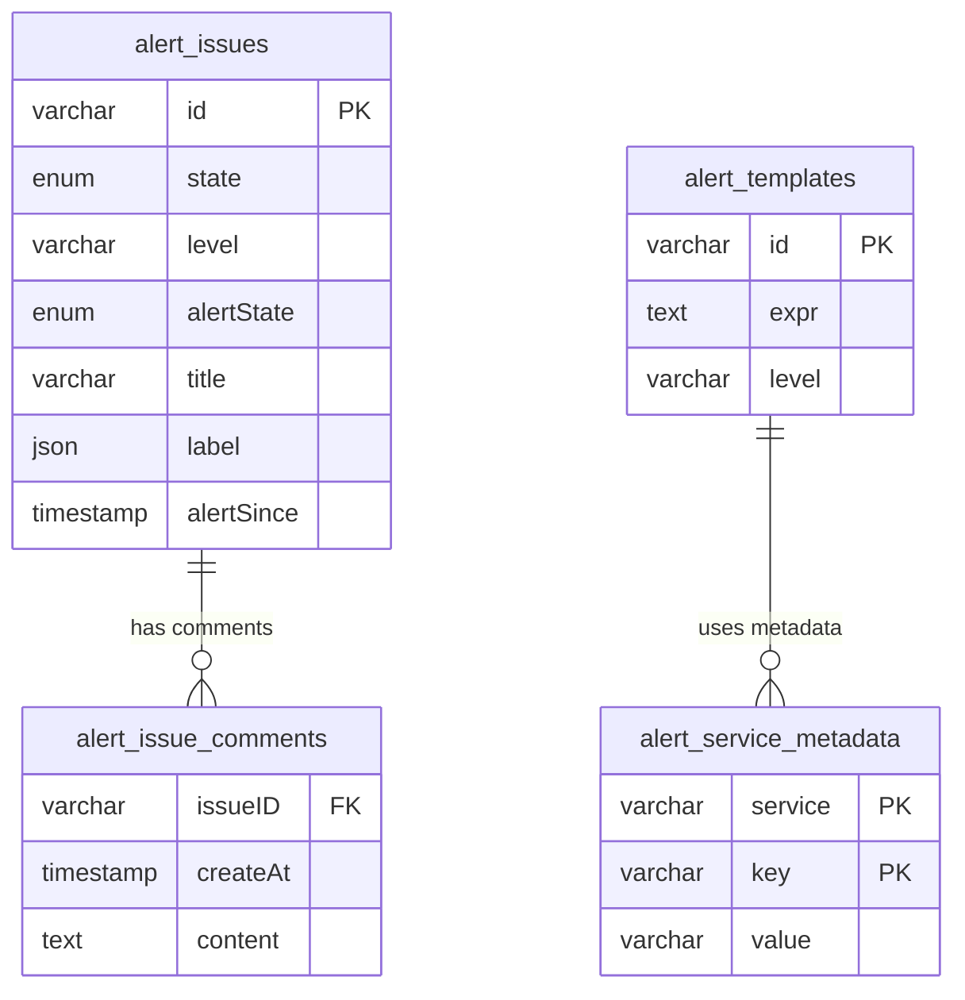

# 数据库设计 - Monitoring & Alerting Service

## 概述

本文档描述了监控告警服务的数据库表结构设计，包括告警问题、评论、模版和服务元数据等核心数据模型。

## 数据表设计

### 1) alert_issues（告警问题表）

存储告警问题的主要信息。

| 字段名 | 类型 | 说明 |
|--------|------|------|
| id | varchar(255) PK | 告警 issue ID |
| state | enum(Closed, Open) | 问题状态 |
| level | varchar(32) | 告警等级：P0/P1/P2/Warning |
| alertState | enum(Restored, AutoRestored, InProcessing) | 处理状态 |
| title | varchar(255) | 告警标题 |
| label | json | 标签，格式：[{key, value}] |
| alertSince | timestamp | 告警发生时间 |

**索引建议：**
- PRIMARY KEY: `id`
- INDEX: `state, level, alertSince`
- INDEX: `alertState, alertSince`

### 2) alert_issue_comments（告警评论表）

存储告警问题的处理记录和评论。

| 字段名 | 类型 | 说明 |
|--------|------|------|
| issueID | varchar(255) FK | 对应 alert_issues.id |
| createAt | timestamp | 评论创建时间 |
| content | text | Markdown 格式，记录 AI/系统/人工动作 |

**索引建议：**
- PRIMARY KEY: `issueID, createAt`
- FOREIGN KEY: `issueID` REFERENCES `alert_issues(id)`

### 3) alert_templates（告警模版表）

存储告警规则模版，支持占位符参数化。

| 字段名 | 类型 | 说明 |
|--------|------|------|
| id | varchar(255) PK | 模版ID |
| expr | text | 表达式，含占位符（如 {apitime_threshold}） |
| level | varchar(32) | 默认告警等级 |

**索引建议：**
- PRIMARY KEY: `id`

### 4) alert_service_metadata（服务元数据表）

存储服务特定的配置参数，用于模版参数化。

| 字段名 | 类型 | 说明 |
|--------|------|------|
| service | varchar(255) | 服务名 |
| key | varchar(255) | 参数名（如 apitime_threshold） |
| value | varchar(255) | 参数值 |

**索引建议：**
- PRIMARY KEY: `service, key`
- INDEX: `service`

## 数据关系

## 数据流转

1. **告警模版** + **服务元数据** → 生成实际告警规则
2. 规则触发时创建 **告警问题记录**
3. 处理过程中在 **评论表** 记录操作日志
4. 问题解决后更新状态为 `Closed`