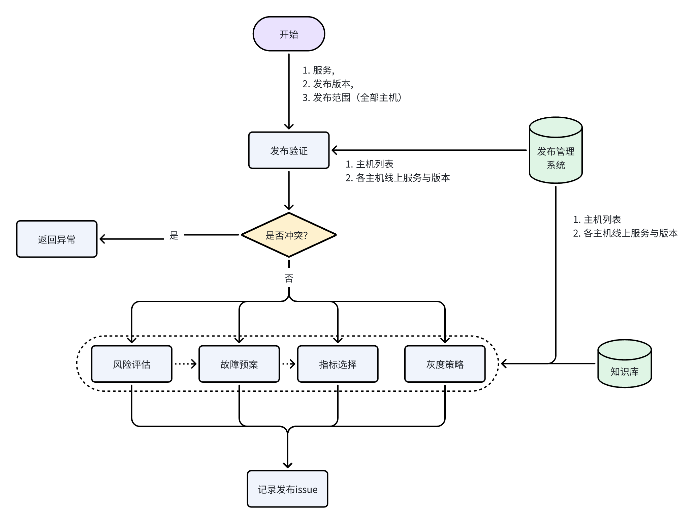

# 发布准备模块

## 模块描述

在用户输入目标服务名和版本号后，智能运维系统会在发布前执行以下准备步骤：

* **发布验证：**&#x68C0;查各主机运行状态，验证服务版本，确认是否满足发布条件

* **风险评估与故障预案：**&#x5206;析发布过程中可能出现的风险与异常，并制定对应的应急处理预案。

* **指标选择：**&#x4ECE;监控指标库中筛选关键指标，作为发布过程中判定异常与故障的依据

* **灰度策略：**&#x5236;定合理的灰度发布方案，让系统在逐步放量过程中保持稳定。

系统会整合上述信息生成发布 issue。该 issue 除了记录本次发布计划，还将作为 ZeroOps 在发布过程中的严格约束依据，用于控制发布进度、监控系统状态以及执行故障修复。

## **参数列表**

{

   `"service"`(string, 必需)：服务名称

   `"verison"`(string, 必需)：服务版本

   `"hosts"`(\[]map\[string]interface{}, 可选)：指定发布的目标主机列表，目前只考虑发布到全部主机。

}

> 发布范围示例：
>
> "hosts": {
>
>   {"host\_id": "sh1-node-001", "host\_ip": "192.168.1.11"},
>
>   {"host\_id": "sh2-node-001", "host\_ip": "192.168.2.11"},
>
> }

## 具体功能划分

### 发布模块流程图



每个功能步骤的返回结果均使用 `StepResult` 结构体表示，用于标准化输出格式，字段包括：

* `name`：功能名称

* `status`：完成状态（success / failed / warning）

* `summary`：简要结果说明

* `details`：详细结果信息

* `timestamp`：完成时间

```go
type StepResult struct {
    StepName  string                 `json:"step_name"`
    Status    string                 `json:"status"` // success / failed / warning
    Summary   string                 `json:"summary"`
    Details   map[string]interface{} `json:"details"`
    Timestamp string                 `json:"timestamp"`
}
```

### 1. 发布验证

#### 功能描述

在接收到用户的发布请求后，系统先判断目标主机和环境是否满足发布条件，包括目标主机上是否已运行相同服务版本，以及主机是否处于正常运行状态。如不满足条件，则返回异常。

#### 实现方式

* 获取发布系统管理的主机列表

* 获取主机的详细信息，包括运行状态、运行服务及当前最新版本。

* 校验主机是否正常运行，并比对服务版本信息。

#### 参数列表

{

   `"service"`(string, 必需)：服务名称

   `"verison"`(string, 必需)：服务版本

   `"nodes"`(\[]map\[string]interface{}, 可选)：指定发布的目标主机列表，目前只考虑发布到全部主机。

}

#### 返回类型

`StepResult` 结构体，包含功能名称、完成状态、简要结果、详细结果和完成时间

```json
{
  "step_name": "VersionCheck",
  "status": "success",
  "summary": "No conflict detected",
  "details": {
    "candidate": "v1.1.0",
    "conflict_reason": "",
    "current": "v1.0.0",
    "has_conflict": false,
    "service": "user-service"
  },
  "timestamp": "2025-08-25T16:17:24+08:00"
}
```

### 2.1 风险评估与故障预案

#### 功能描述

根据待发布的服务及其上下游服务链路，分析本次发布过程可能出现的异常/故障，并制定相应的处理预案

#### 实现方式

* 查询ElasticSearch，获取服务上下游链路

* 查询预设知识库文档，列出可能的异常/故障列表  ➡️  调用大模型分析

* 基于可能的异常/故障列表，查询知识库并制定对应的处理预案

#### 参数列表

{

   `"service"`(string, 必需)：服务名称

   `"verison"`(string, 必需)：服务版本

   `"hosts"`(\[]map\[string]interface{}, 可选)：指定发布的目标主机列表，目前只考虑发布到全部主机。

}

#### 返回类型

`StepResult` 结构体，包含功能名称、完成状态、简要结果、详细结果和完成时间

```json
{
      "step_name": "RiskPrediction",
      "status": "success",
      "summary": "2 risks identified",
      "details": {
        "risks": [
          {
            "mitigation": "restart",
            "type": "memory_leak"
          },
          {
            "mitigation": "rollback",
            "type": "cpu_spike"
          }
        ],
        "service": "user-service"
      },
      "timestamp": "2025-08-25T16:17:24+08:00"
    }
```

### 2.2 指标选择

#### 功能描述

根据待发布服务及风险评估结果，从 Prometheus 监控指标中筛选在发布过程中需要重点关注的指标，并返回指标列表、告警阈值及其所属类别。

#### 实现方式

* 获取prometheus的全部监控指标

* 读取预设知识文档，根据待发布的服务，找出发布该服务需要重点监控的指标  ➡️  调用大模型分析

* 根据风险评估结果，结合知识库，筛选重点监控的指标  ➡️  调用大模型分析

* 查询知识库，为各指标设置告警阈值  ➡️  调用大模型，结合系统实际运行情况分析后设置

#### 参数列表

{

   `"service"`(string, 必需)：服务名称

   `"verison"`(string, 必需)：服务版本

   `"hosts"`(\[]map\[string]interface{}, 可选)：指定发布的目标主机列表，目前只考虑发布到全部主机。

   `"riskResult"`(StepResult, 可选)：风险评估结果，可根据风险评估的结果选择指标

}

#### 返回类型

`StepResult` 结构体，包含功能名称、完成状态、简要结果、详细结果和完成时间

```json
{
      "step_name": "MetricAnalysis",
      "status": "success",
      "summary": "3 group metrics identified with thresholds",
      "details": {
        "metrics": [
          {
            "candidates": [
              "user-service_service_cpu_user_seconds_total",
              "user-service_service_cpu_system_seconds_total"
            ],
            "name": "CPU",
            "thresholds": [
              "3s",
              "5s"
            ]
          },
          {
            "candidates": [
              "user-service_service_memory_used_bytes",
              "user-service_service_memory_active_bytes"
            ],
            "name": "Memory",
            "thresholds": [
              "1GB",
              "2GB"
            ]
          },
          {
            "candidates": [
              "user-service_service_errors_total"
            ],
            "name": "Error Rate",
            "thresholds": [
              "0.1%"
            ]
          }
        ],
        "service": "user-service"
      },
      "timestamp": "2025-08-25T16:17:24+08:00"
}
```

### 2.3 灰度策略

#### 功能描述

根据发布系统管理的主机列表，和预期发布范围（目前只考虑全部主机都发布）制定灰度发布策略，包括发布批次、每一批次的主机列表、每一批次的观察时间

#### 实现方式

* 接收主机列表参数，确定服务预期发布的目标主机

* 读取预设知识文档，确定合适的发布批次  ➡️  调用大模型分析制定

* 结合知识文档，待发布服务和系统中各主机运行状态，选择各批次发布的主机  ➡️  调用大模型分析制定

* 根据知识文档确定每一批次发布和故障修复后的观察时间

#### 参数列表

{

   `"service"`(string, 必需)：服务名称

   `"verison"`(string, 必需)：服务版本

   `"hosts"`(\[]map\[string]interface{}, 可选)：指定发布的目标主机列表，目前只考虑发布到全部主机。

}

#### 返回类型

`StepResult` 结构体，包含功能名称、完成状态、简要结果、详细结果和完成时间

```json
{
      "step_name": "ReleasePlan",
      "status": "success",
      "summary": "3 batches created",
      "details": {
        "gray_strategy": {
          "batches": [
            {
              "batch_id": 1,
              "observation_time": "600s",
              "hosts": [
                {
                  "host_id": "bj1-node-001",
                  "host_ip": "127.0.0.1"
                }
              ]
            },
            {
              "batch_id": 2,
              "observation_time": "1800s",
              "hosts": [
                {
                  "host_id": "sh1-node-001",
                  "host_ip": "192.168.1.11"
                },
                {
                  "host_id": "sh2-node-001",
                  "host_ip": "192.168.2.11"
                }
              ]
            },
            {
              "batch_id": 3,
              "observation_time": "3600s",
              "hosts": [
                {
                  "host_id": "sh1-node-002",
                  "host_ip": "192.168.1.12"
                },
                {
                  "host_id": "sh1-node-003",
                  "host_ip": "192.168.1.13"
                },
                {
                  "host_id": "sh2-node-002",
                  "host_ip": "192.168.2.12"
                },
                {
                  "host_id": "sh2-node-003",
                  "host_ip": "192.168.2.13"
                }
              ]
            }
          ]
        },
        "service": "user-service"
      },
      "timestamp": "2025-08-25T16:17:24+08:00"
}
```

### 3. 记录发布issue

#### 功能描述

在发布准备流程完成后，系统整合每个步骤的返回结果，生成结构化的发布 issue 并记录。该 issue 除了作为常规发布文档外，还将作为智能运维系统在发布变更管理流程中的标准化参考。后续大模型在指标监控、根因分析或策略决策时，会以发布 issue 作为输入约束，确保分析和推理在规范范围内执行，从而降低幻觉风险并提升运维安全性。

#### 实现方式

* 收集发布准备模块各功能（发布验证、风险评估与预案、指标选择、灰度策略）的返回结果

* 整合各功能结果，生成结构化发布 issue 并进行记录。

#### 参数列表

无

直接调用同package下的各功能方法，获取其他各功能的`StepResult`返回结果

#### 返回类型

JSON

```json
      
{
  "candidate": "v1.1.0",
  "created_at": "2025-08-25T16:17:24+08:00",
  "service": "user-service",
  "steps": [
    {
      "step_name": "VersionCheck",
      "status": "success",
      "summary": "No conflict detected",
      "details": {
        "candidate": "v1.1.0",
        "conflict_reason": "",
        "current": "v1.0.0",
        "has_conflict": false,
        "service": "user-service"
      },
      "timestamp": "2025-08-25T16:17:24+08:00"
    },
    {
      "step_name": "MetricAnalysis",
      "status": "success",
      "summary": "3 group metrics identified with thresholds",
      "details": {
        "metrics": [
          {
            "candidates": [
              "user-service_service_cpu_user_seconds_total",
              "user-service_service_cpu_system_seconds_total"
            ],
            "name": "CPU",
            "thresholds": [
              "3s",
              "5s"
            ]
          },
          {
            "candidates": [
              "user-service_service_memory_used_bytes",
              "user-service_service_memory_active_bytes"
            ],
            "name": "Memory",
            "thresholds": [
              "1GB",
              "2GB"
            ]
          },
          {
            "candidates": [
              "user-service_service_errors_total"
            ],
            "name": "Error Rate",
            "thresholds": [
              "0.1%"
            ]
          }
        ],
        "service": "user-service"
      },
      "timestamp": "2025-08-25T16:17:24+08:00"
    },
    {
      "step_name": "ReleasePlan",
      "status": "success",
      "summary": "3 batches created with observation times",
      "details": {
        "gray_strategy": {
          "batches": [
            {
              "batch_id": 1,
              "observation_time": "600s",
              "hosts": [
                {
                  "host_id": "bj1-node-001",
                  "host_ip": "127.0.0.1"
                }
              ]
            },
            {
              "batch_id": 2,
              "observation_time": "1800s",
              "hosts": [
                {
                  "host_id": "sh1-node-001",
                  "host_ip": "192.168.1.11"
                },
                {
                  "host_id": "sh2-node-001",
                  "host_ip": "192.168.2.11"
                }
              ]
            },
            {
              "batch_id": 3,
              "observation_time": "3600s",
              "hosts": [
                {
                  "host_id": "sh1-node-002",
                  "host_ip": "192.168.1.12"
                },
                {
                  "host_id": "sh1-node-003",
                  "host_ip": "192.168.1.13"
                },
                {
                  "host_id": "sh2-node-002",
                  "host_ip": "192.168.2.12"
                },
                {
                  "host_id": "sh2-node-003",
                  "host_ip": "192.168.2.13"
                }
              ]
            }
          ]
        },
        "service": "user-service"
      },
      "timestamp": "2025-08-25T16:17:24+08:00"
    },
    {
      "step_name": "RiskPrediction",
      "status": "success",
      "summary": "2 risks identified",
      "details": {
        "risks": [
          {
            "mitigation": "restart",
            "type": "memory_leak"
          },
          {
            "mitigation": "rollback",
            "type": "cpu_spike"
          }
        ],
        "service": "user-service"
      },
      "timestamp": "2025-08-25T16:17:24+08:00"
    }
  ],
  "title": "Release Preparation - user-service v1.1.0"
}

    
```

